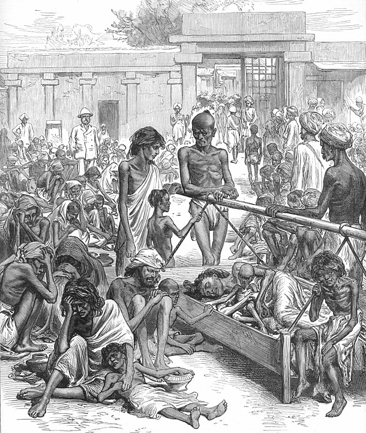
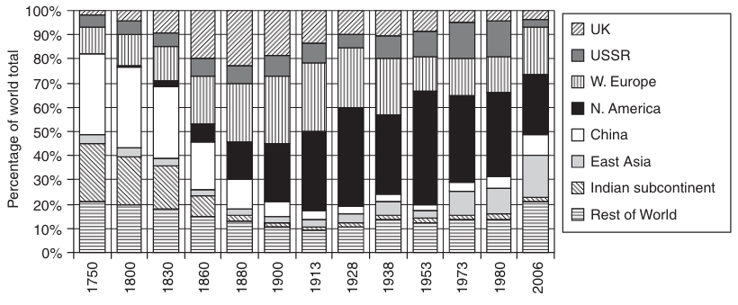

```{r setup, include=FALSE}
knitr::opts_chunk$set(echo = FALSE, warning = FALSE,
                      message = FALSE, fig.align='center', fig.retina=3,
                      out.width="75%")
```

```{r xaringan-themer, include = FALSE}
library(xaringanthemer)
style_solarized_light()
source("helper_functions/theme_lecture.R")
xaringanExtra::use_webcam()
xaringanExtra::use_tile_view()
```


## Today's Goals

.Large[
+ The revolution in *agriculture*
  + It predates the industrial revolution
  + Persists throughout the industrial revolution
+ Agriculture is mostly what people do even long after the industrial revolution!

> "The importance of agriculture everywhere ... cannot be overestimated: most countries were still agrarian on the eve of the First World War; the world was still a world of tillers of the soil" (Osterhammel, p. 211).

+ The impact of the industrial revolution on *global patterns of economic production*

]

---

.Large[
## Today's Plan

1. Agriculture across the 19th century
2. The form and spread of industrialization
3. Industrial production in global trade
4. Global specialization and its consequences
5. Conclusion: the costs of not industrializing?
]

---

## Agriculture as a sector: some basic points

.large[
1. The environment determines what it is possible to cultivate
  + Not immutable but constrains where it is economically sensible to grow certain crops
2. Plants grow by taking nutrients from the soil 
  + How intensively do you work the soil?
  + How do you regenerate fertility?
3. Plants grow in a biologically determined life-cycle:
  + Planting seasons
  + Timing is important
  + Labor demand is often uneven
4. The environment effects output through weather/pests/disease
  + Still true: crop yields fluctuate annually based on these factors
  + E.g. 'rust' removes 5/10% of wheat crop each year in 19th c.
]
---

## Thinking about agriculture's challenges

```{r, fig.height=4, fig.width=6, fig.retina=4}
library(tidyverse)
library(readxl)
library(scales)

worldpop <- read_excel("data/mpd2020.xlsx", sheet = "Regional data",
                       skip = 2) %>% 
  select(Year, Population = ...18)

worldpop %>% 
  filter(Year <= 1920) %>% 
  ggplot(aes(Year, Population)) + 
  geom_col() + 
  theme_lecture + 
  ggtitle("Estimates of world population: 1820-1920") + 
  scale_y_continuous(label=comma) +
  ylab("Population (1,000s)")


```

---

## How to feed more people

.Large[
1. Use more labor
  + But "For industrialization to occur, it had to be possible to produce more food with fewer people." (Dennison and Simpson, 2010)
2. Use more land
3. Use more capital (tools, fertilizer, infrastructure, etc.)
4. Get better at it... (Productivity gains)
]

---

.Large.left-column[
## The agricultural labor force

+ The biggest source of global employment in 1800
]

.right-column[
```{r, fig.height=5, fig.width=6, fig.retina=4}

aglab <- tibble(Region = rep(c("Europe", "Russia", "Western Settlement", "Rest of World"), each = 4), date = rep(c(1800, 1850, 1880, 1910), 4), Labor = c(31.2,36.2,39.2,41.4,12.8,17.6,25.7,37,1.2,5.1,8.9,11,45.3,59,74,89.5))
  

aglab %>% 
  ggplot(aes(date, Labor, group = Region, color = Region)) +
  geom_point() + 
  geom_line() + 
  theme_lecture + 
  xlab("") +
  ylab("Agricultural Labor Force (Millions)") + 
  ggtitle("Where did the agricultural labor force grow?")
```
]

---

.large.left-column[
## The growing use of land

+ increases everywhere except Western Europe

]

.right-column[
```{r, fig.height=5, fig.width=6, fig.retina=4}

agland <- tibble(Country = rep(c("France", "Germany",
                                "USA", "Egypt", "Thailand"), each = 4), 
                date = rep(c(1800, 1850, 1880, 1910), 5), 
                land = c(33.5, 34.3, 32.7, 29.6,
                         NA, 24.4, 26.2, 26.2,
                         NA, 45.7, 76.1, 140.4,
                         1.3, 1.7, 1.9, 2.3,
                         NA, .9, 1.1, 2))
  

agland %>% 
  group_by(Country) %>% 
  mutate(land_index = land/land[date == 1850]) %>% 
  ggplot(aes(date, land_index, group = Country, color = Country)) +
  geom_point() + 
  geom_line() + 
  theme_lecture + 
  xlab("") +
  ylab("Agricultural Land use Index") + 
  ggtitle("Where did land intensity grow?")

```
]

---

.Large.pull-left[
## Agricultural capital

1. Land improvement (fencing, terracing, etc)
2. Buildings (stables e.g.)
3. Tools and machines
4. Livestock (who pulls the plow?)
5. Working capital (animal feed, existing stocks)
]

.Large.pull-right[
+ Difficult to measure!
+ Except maybe land-improvement along 'frontiers'
+ Almost certainly grew in 1850-1910 period -- but don't exagerate technological change!

> "In 1950 horses still accounted for 85 percent of traction in European agriculture" (Osterhammel, p. 213).
]

---

## Agricultural revolutions

.Large[
+ The term is debated
  - Usually we mean growth in *agricultural productivity* in yields/hectare or yields/worker
+ By this metric a story of late-18th c. England
  - In 1800 English ag. laborer produces ~2X Russian laborer
  - **Not** a general European story
  - Rice cultivation among most-productive since about 12th century on a **per hectare** basis
    + Uses a lot of labor
+ Much of the agricultural revolution model in wheat would not work in rice
  - No land to open up, labor use very intensive, little scope for economies of scale
]

---

.large.pull-left[
## Agriculture and famine

+ The escape from famine happens at different times in different parts of the world
  - The Americas possibly first
  - Eastern and Western edges of Eurasia after 1850
  - Elsewhere much later
+ Famines of 19th c. are **catastrophic**
  - 1870s and 1890s in India/China: excess mortality estimated at 31-59 million!!
+ Growth in food markets seem on average to help (supply chases prices) but sometimes to hurt e.g. India in 1870s.
]

.pull-right[

]

---

## Summing up

.pull-left.large[

+ There are real productivity gains but extensive growth is key

> "The great gains of the nineteenth century came rather from the extensive growth of production in frontier areas of the Tsarist Empire, the United States, Argentina, and Canada, as well as in India" (Osterhammel, p. 215)
]

.pull-right.large[
+ Agriculture becomes more *capitalist*:
  - Wage labor intensive
  - Export oriented
  - Controlled by large and politically influential operators
+ The politics of agricultural decline in Europe, and its rise elsewhere are important to the later 19th c.
]

---

.large[
### Industrialization

+ Starts in Britain.
+ Many theories as to why: Coal, institutions, wages, colonies, etc.

]
.center[

]

---

## The spread of industrialization

.large.pull-left[
> "Britain’s initial lead over continental Europe should not be exaggerated. Celebrated British inventions soon spread abroad, and by 1851 it was clear to everyone drifting through the marvels of the Crystal Palace that the United States had overtaken Britain in machine-building technology" (Osterhammel, 664).
]

.large.pull-right[
+ The question of the 'Great Divergence' (between European/Western and non-European/Western living standards)
  - Since 2000s has been pushed towards 19th c. and associated more strongly with industrialization
  - Timing the divergence remains an active field, but strong case for the IR as the driving force
]
---

## Features of industrialization

.Large[
+ Concentrated mostly in existing product categories and forms of production
  - Much industrialization before factory work became the norm
+ Particularly applied in **textiles**, **metallurgy**, and **transport**
  - The inputs of textiles are agricultural goods
  - Metallurgy e.g. steel-making with coal power crucial in breaking link between agricultural sector and industrial growth
  - Transport includes railways and steamships
]

---

## The consequences of industrialization

.Large[
1. Strengthens military advantages of industrializers
  + Facilitates colonization
2. The transport revolution facilitates long-distance trade -- particularly over land
3. Geographic variation in production pushes for global specialization

.center[**Railroads, steamships and colonialism also drive trade, making the system self-reinforcing**]
]
---

```{r merch, out.width="90%", fig.retina=4, fig.height=4, fig.width=6}

trade_dat <- read_csv("data/merchandise-exports-gdp-cepii.csv")
names(trade_dat) <- c(names(trade_dat)[1:3], "Value")

trade_dat %>% 
  filter(Entity == "World", Year <= 1910, Year >= 1840) %>% 
  ggplot(aes(Year, Value)) + 
  geom_line() +
  geom_point() +
  ylab("Value of global merchandise exports\nas a share of GDP (%)") +
  xlab("") +
  ylim(c(0,15)) +
  labs(caption = "Source: Fouquin and Hugot; CEPII 2016; National data",
       title = "Global Exports as Share of Global GDP",
       subtitle = "1840-1910") +
  theme_lecture
```
---

### Who trades what? Heckscher-Ohlin effects

.pull-left[
#### Land Abundant Exporters

Factors   |  Technology  |  Exports
```{r ho_mermaid, fig.retina=4}
library(DiagrammeR)

mermaid("
graph LR
A((Abundant Land)) --> D[Production<br>Process]
B((Labor)) --> D
C((Capital)) --> D
D --> E((Agri.<br>Produce))")

```
]

.pull-right[
#### Labor Abundant Exporters
Factors   |  Technology  |  Exports
```{r ho_mermaid_2, fig.retina=4}
library(DiagrammeR)

mermaid("
graph LR
A((Land)) --> D[Production<br>Process]
B((Abundant Labor)) --> D
C((Capital)) --> D
D --> E((Manuf.<br>goods))")

```
]

---

### The consequences of global commodity trade

.pull-left[
]

.pull-right[
]

---

.left-column[
## Railroads drive down overland transport costs

+ Steamships are late innovations
+ Railroads reduce costs of moving goods from interiors to coasts
]
.right-column[
]

---

## Consequences of commodity price convergence

.large[
+ Factors of production are forced into competition
    - Argentinian farmers vs French farmers, etc. 
+ Places with abundant land can produce grain more cheaply
    - Convergence in global grain prices drives farmers in land-scarce regions out of the market!
    - High wages in settler colonies (Argentina, Australia, Canada...) push European real wages up!
    
> "Less frequently remarked upon, but equally obvious, are the long-run implications [of the Americas] for European income distribution. Such an increase in land endowments would inevitably spell disaster for European landowners. Over-all living standards might increase, but in the long run European rents would decline, with European labor or capital benefitting." <br> -O'Rourke, "European Grain Invasion", p. 775
]
---

```{r uk_factors, fig.align='center', fig.retina=3, out.width="90%", fig.width=6, fig.height=4}
library(tidyverse)
library(ggthemes)

fp <- data.frame(date = seq(1877, 1912, 5),
                 real_wage = c(100, 104,
                               113.9, 118.8,
                               127.6, 121.6,
                               128.8, 125.9),
                 real_land = c(100, 77.3, 76.1, 
                               76.7, 82.2, 69.8,
                               68.3, 58.2))

fp <- fp %>%
  gather("factor", "index", -date) 

fp %>% 
  ggplot(aes(date, index, color=factor)) +
  geom_line() + 
  geom_point()+
  theme_hc() +
  scale_color_hc() +
  guides(color = FALSE) +
  geom_label(data = fp %>% filter(date==1912),
             aes(date, index, color=factor, 
                 label = c("Real Wage", "Real Land Prices"))) +
  xlim(c(1875, 1915)) +
  theme_lecture  +
  ggtitle("Hekscher-Ohlin at Work?", 
          subtitle = "Index of British Land and Labor Prices")

```

---

```{r wage_rent_ratios, fig.align='center',fig.retina=3, out.width="90%", fig.width=6, fig.height=4}
library(readxl)
library(ggrepel)

wr <- read_xlsx("data/wage_rent_ratios.xlsx")

wr <- wr %>% gather("Country", "Index", - Year) %>% 
  mutate(Continent = ifelse(Country %in% c("Australia", "US"), 
                            "New World", "Old World"),
         Policy = ifelse(Country %in% c("France", "Germany"),
                                 "Protectionist", "Open"))

wr %>% 
  ggplot(aes(Year, Index, 
             group = Country, 
             color = Continent, linetype = Policy)) +
  geom_line() + 
  geom_point()+
  theme_hc() +
  scale_color_hc() +
  guides(color = FALSE) +
  geom_label_repel(data = wr %>% filter(Year==1912),
             aes(Year, Index, color=Continent, 
                 label = Country)) +
  xlim(c(1875, 1915)) +
  theme_lecture  +
  ggtitle("Evidence of Convergence in Wage-Rental Ratios?", 
          subtitle = "1877 to 1912")

```

---

## Summing up

.center.Large[
> "Over the course of the nineteenth century, transoceanic trade in bulk commodities such as grains, metals, and textiles became more and more common. One implication was that long-distance trade now began to displace domestic producers in large numbers, be they Indian textile producers or European farmers. European land found itself in direct competition with the vast and fertile land endowments of the New World, while Indian weavers found themselves outcompeted by European technology and capital" (Findlay and O'Rourke, p. 385).
]

---

## Conclusion: the legacies of specialization

.large[
+ Around 1800 British merchants selling manufactured textiles to West Africa are selling mostly **Indian** manufactured goods
  - This changes decisively by 1820
+ Industrialization generates a **global division of labor** between places that specialize in primary goods and those that specialize in manufactures

> "Broadly speaking, however, it is not inaccurate to view world trade in the nineteenth century in North–South terms, with the rich and industrialized North exporting industrial goods in return for the primary exports of the poor and agricultural South. This was certainly truer in the late nineteenth century than it had been before, and truer than it has been since World War II as well" (Findlay & O'Rourke, 413-414).

+ Areas of western settlement (US, Can., Arg., Aus.) exceptions
]

---

## Conclusion: the legacies of specialization

.large[
+ The 19th c. is when the largest divergence of living standards emerges globally

> "...the period 1880-1913 has to be regarded as one in which many tropical countries grew as rapidly as many of the industrial countries" (Arthur Lewis, in Findlay and O'Rourke, p. 415)

+ **Pessimistic view**: global specialization de-industrialized the global south, forcing them into concentration on primary products
  - Primary products de-industrialize via **Dutch disease**
  - The instability of the **commodity lottery**
+ **Optimistic view**: Northern industrialization was an 'engine of growth' which provided demand for southern products as well as loans
  - The Lewis developmental model with "unlimited supplies of labor"
+ Does **Engel's Law** doom them in the long-run?
]

