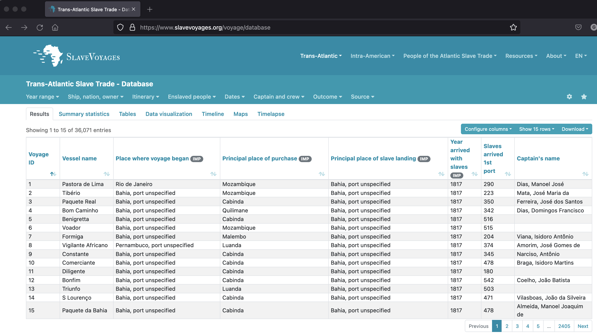

```{r setup, include=FALSE}
knitr::opts_chunk$set(echo = FALSE, warning = FALSE,
                      message = FALSE, fig.align='center', fig.retina=3,
                      out.width="75%")
```

```{r xaringan-themer, include = FALSE}
library(xaringanthemer)
style_solarized_light()
source("helper_functions/theme_lecture.R")
xaringanExtra::use_webcam()
xaringanExtra::use_tile_view()
```


## Today's Goals

.Large[

1. Give a brief introduction to the atlantic slave trade -- in particular its scale

2. Introduce a long-running historical dispute over the role of the Atlantic slave trade in British industrialization
  + We will follow some of the debate over *how* the slave trade and slaveholder wealth contributed to industrialization

3. Introduce some large database sources and how historians use them
    + These are important in their own right, and interesting examples of large-scale data-intensive historical projects

]

---

class: center, middle, inverse

# The Scale of the Atlantic Slave Trade

---

.left-column[

"...in every year ... to 1831, more Africans than Europeans quite likely came to the Americas, and not until ... the 1880s did the sum of net European immigration start to match and then exceed the cumulative influx from Africa." <br> &mdash; Eltis, "Free and Corced Transatlantic Migrations: Some Comparisons," *American Historical Review*, p. 255.
]

.right-column[
```{r, fig.height=5, fig.width=6, fig.retina=4}
library(tidyverse)
library(haven)
library(scales)

df <- read_sav("data/tastdb-exp-2020.sav")

df %>% 
  group_by(YEARDEP) %>% 
  summarise(slave_exports = sum(SLAXIMP, na.rm = T)) %>% 
  ggplot(aes(YEARDEP, slave_exports)) +
  geom_line() +
  xlab("Year") +
  ylab("Number of people embarked in African ports") +
  scale_y_continuous(label = comma) +
  theme_lecture +
  ggtitle("Annual imputed slave exports", 
          subtitle = "The Atlantic Slave Trade Database 2019") +
  labs(caption = "Author's calculations: Slave Voyages Database 2019")
```
]


---

```{r, fig.height=5, fig.width=7, fig.retina=4}
library(readxl)

agg <- read_xls("data/slave-totals-by-flag.xls")

agg %>% slice(-16) %>% 
  rename("Date" = ...1) %>% 
  mutate(Other = Totals - `Great Britain`) %>% 
  select(Date, `Great Britain`, Other) %>% 
  pivot_longer(-Date, names_to = "id", values_to = "count") %>% 
  ggplot(aes(Date, count, fill = id)) +
  geom_col(position = "fill") +
  theme_lecture +
  scale_fill_manual(values = c("coral", "black")) +
  scale_y_continuous(labels = percent) +
  ylab("") +
  theme(axis.text.x=element_text(angle=45, hjust=1)) +
  labs(title = "Britain's Share of the Global Slave Trade",
       subtitle = "25 year bins",
       caption = "Author's calculations: Slave Voyages Database 2019")

```


---

.pull-left.Large[
> "Historical statistics, their display and manipulation, are similar to prose-based evidence in narrative or rhetorical argument: **both are only ever as valid or reliable as the people or institutions that produced them, on the one hand, and the historian herself who manipulates and judges them, on the other**. <br> &mdash;Hudson & Ishizu, *History by Numbers*, p. 12-13
]

--

.pull-right[
## Good questions to ask

.Large[

1. Where do these numbers come from?
2. How are they recorded?
3. How complete are they?
4. Do they measure the same thing over time?
]
]
---

[](https://www.slavevoyages.org/voyage/database#visualization)

---

class: inverse, center, middle

# Slavery and Industrialization: the Williams thesis

---

.pull-left.center[
### The 'Williams Thesis': slavery and British industrialization


]

.pull-right.center[

]

---

## The profits of the slave trade and industrialization

.large[
> The triangular trade thereby gave a triple stimulus to British industry. The Negroes were purchased with British manufactures; transported to the plantations, they produced sugar, cotton, indigo, molasses and other tropical products, the processing of which created new industries in England; while the maintenance of the Negroes and their owners on the plantations provided another market for British industry, New England agriculture and the Newfoundland fisheries. ...**The profits obtained provided one of the main streams of that accumulation of capital in England which financed the Industrial Revolution.** <br> &mdash;Williams, *Capitalism & Slavery*, p. 52


+ Williams points to the links between the broader Atlantic system and British prosperity
+ "one of the main streams": important but vague

]

---

## Critiques: The 'small ratios' debate

.large[
+ Engerman's critique :"of some followers of Eric Williams": 

> "...to what extent was the over-all level of investment in society raised by the profits of the slave trade?" <br> &mdash;Engerman, "The Slave Trade and British Capital Formation", *Business History Review*, p. 433

+ Under very generous assumptions about profits in the slave trade these profits make up 2.4% to 10.8% of British total investment
  
> "...even under some implausible assumptions, the aggregate contribution of slave trade profits ... could not be so large as to bear weight as *the*, or *a*, major contributing factor." <br> &mdash; Ibid. p. 441
]


---

.pull-left.large[
## The slave trade and backward linkages

#### Areas that benefitted

1. Ship-building
2. wool trade
3. Cotton trade
4. sugar refining
5. Rum distilling
6. pacotille
7. Metallurgy
8. Port-towns
]

--

.pull-right.large[
> "Early critics focused discussion on the profits of the slave trade but his [Williams'] thesis was broader, and more sophisticated, than they acknowledged. It left room for linkages of many kinds and it is now time to take a broader look at the connections between the rise of merchant capitalism, in which slavery played a central role, and British economic growth." <br> &mdash; Zahedieh, "Eric Williams and William Forbes," *Economic History Review*, p. 784
]

---

## Slaves as a sources of *wealth*

.large[

+ The partial abolition of slavery (1833) was accompanied by the *Slave Compensation Act 1837* which compensated slave **owners** for losing their slaves
+ These payments were financed by the British state (paid for by taxpayers) and amounted to roughly 20 million GBP
+ Slave-holders needed to claim these payments and their claims form the basis for our understanding of slave *ownership* in 1833

### The ubiquity of slave wealth

> "...'slave property' permeated certain sections of British society, and it appears important to be as precise as possible about the interweaving of that property with other forms of wealth in Britain." <br> &mdash; Draper, "Possessing Slaves", *History Workshop Journal*, p. 97

]

---

.center[
[](https://www.ucl.ac.uk/lbs/)
]
